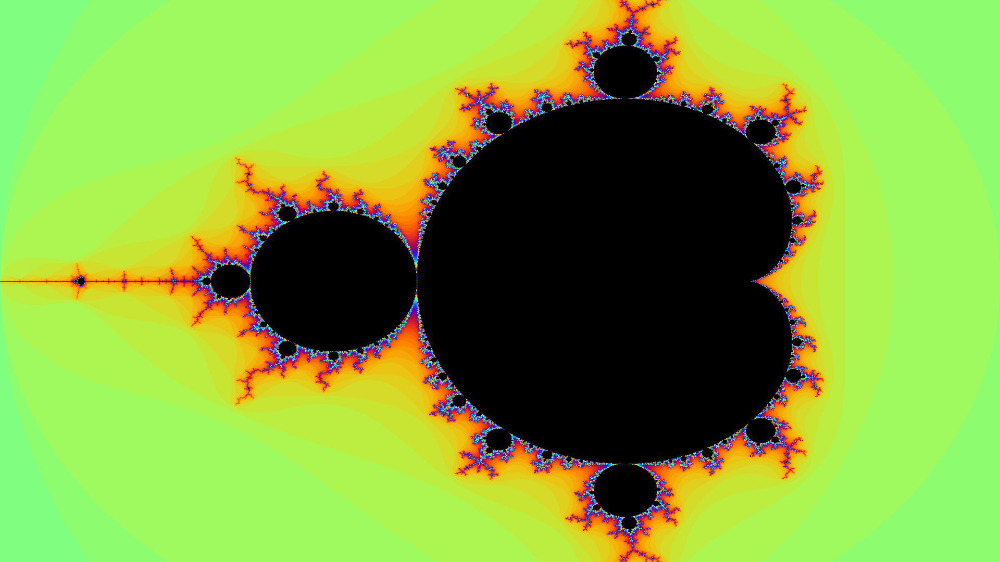

# Fractal
Simple fractal generator built with C and SDL2 library.

## Results
### Mandelbrot
Iterative formula of the Mandelbrot set
$$z_{n+1} = z_n^2 + c$$

Generation with 10 000 iterations


## Tech Stack
### Language
C
### Libraries
SDL2
### Graphics API
OpenGL
### Build System/Tools
- CMake
- GCC compiler
- VsCode IDE
### Operating Systems
- Linux
- Windows

## How to use ?
The CMakeLists file already includes a fetching functionnality in case SDL2 isn't already installed in your computer.
You can directly use the following commands after cloning the project :
```
cmake -B build          # generates build files
cmake --build build     # compile
```

Before running, you may need to pay attention to the number of iterations defined in the include/Functions.h directory.
The default number of iterations has been set to 10 000 (for fun lol) but you can set it to whichever value you want (200 iterations is a good starting point).
After fixing the number of iterations, you can run the generation using this command :
```
./build/Fractale        # run
```
## Dependencies
```
SDL2 >= 2.30.0     # Used as graphic library
lim                # For complex math functions (csqrt, etc)
```